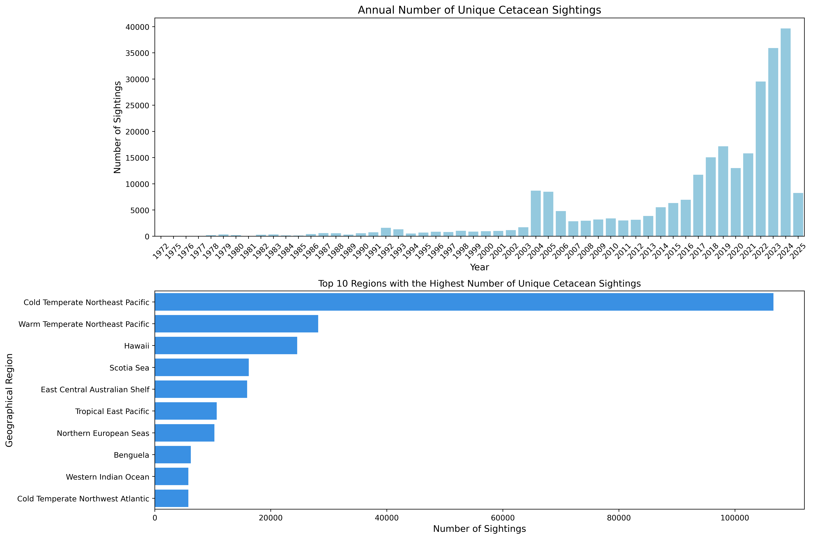
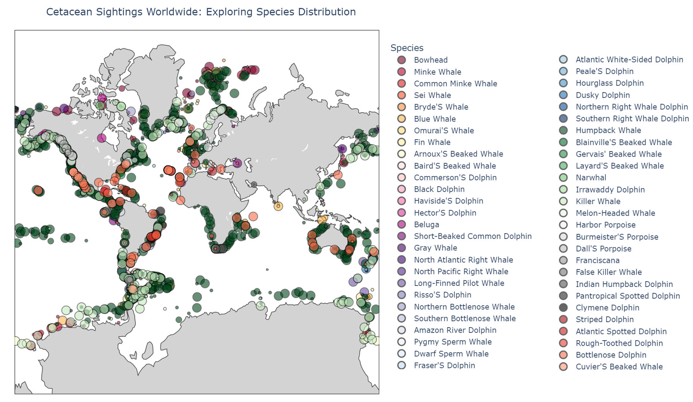
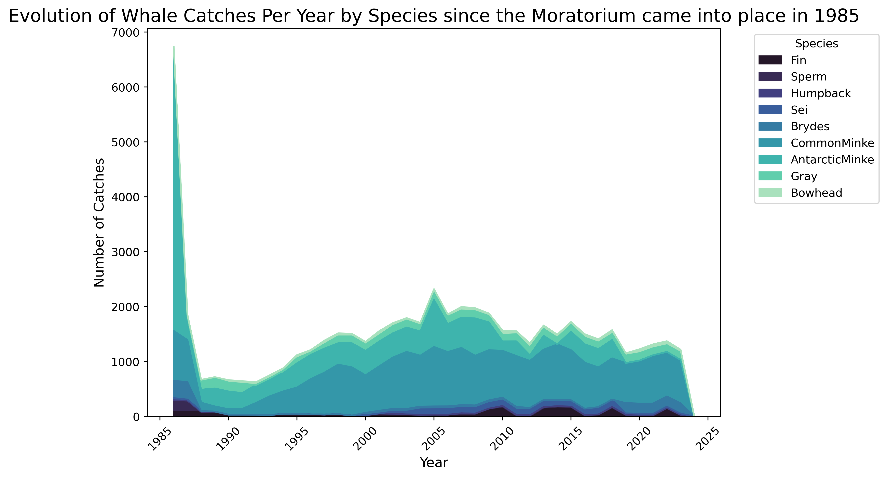
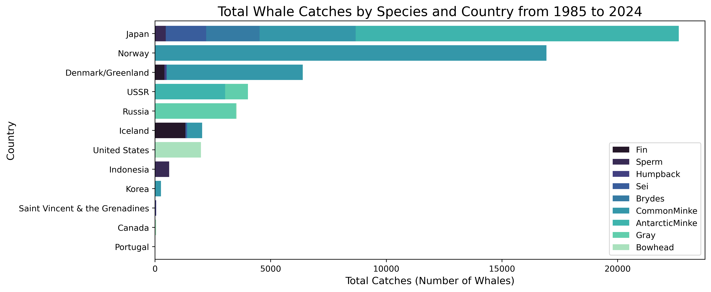

# Project of Data Visualization (COM-480)

| Student's name | SCIPER |
| -------------- | ------ |
| Camille Challier | 311020 |
| Cyrill Strassburg |  |
| Eglantine Vialaneix | 324293 |

[Milestone 1](#milestone-1) • [Milestone 2](#milestone-2) • [Milestone 3](#milestone-3)

## Milestone 1 (21st March, 5pm)

**10% of the final grade**

This is a preliminary milestone to let you set up goals for your final project and assess the feasibility of your ideas.
Please, fill the following sections about your project.

*(max. 2000 characters per section)*

### Dataset

> Find a dataset (or multiple) that you will explore. Assess the quality of the data it contains and how much preprocessing / data-cleaning it will require before tackling visualization. We recommend using a standard dataset as this course is not about scraping nor data processing.
>
> Hint: some good pointers for finding quality publicly available datasets ([Google dataset search](https://datasetsearch.research.google.com/), [Kaggle](https://www.kaggle.com/datasets), [OpenSwissData](https://opendata.swiss/en/), [SNAP](https://snap.stanford.edu/data/) and [FiveThirtyEight](https://data.fivethirtyeight.com/)), you could use also the DataSets proposed by the ENAC (see the Announcements section on Zulip).

For this project, we are working with multiple datasets related to cetacean.

- **Global info about Cetacean**: From <strong><a href="https://www.wikipedia.org/">Wikipedia</a></strong>, well-known free encyclopedia. Various images and metadata about the species and their descriptions were retrieved using their <strong><a href="https://www.mediawiki.org/wiki/API:Main_page">API</a></strong>. Some images and infos are still being extracted from the platform. These informations compose the less 
- **Global sightings of Cetaceans**: From <strong><a href="https://happywhale.com/home">HappyWhale</a></strong>, a platform for marine mammal sightings contributed by citizen scientists and researchers. The HappyWhale dataset was extracted from <strong><a href="https://seamap.env.duke.edu/">OBIS Seamap</a></strong>, which serves as the World Data Center for Marine Mammal, Seabird, Sea Turtle, Shark & Ray Distributions and aggregates various datasets, including HappyWhale. This extracted dataset encompasses records of over 275191 sightings spanning from 1972 to the present day. It comprises 18 attributes, including: Geographical coordinates (latitude & longitude),Species name, Unique animal identification (tracking repeated sightings of the same individual), Group size, Sex (though missing for many sightings, but not needed), Date of sighting, Locality and environmental details. Some location information, such as country and water zone, is missing, but since we have the coordinates, we might not need it or could extract it if necessary. As a large number of events are present in the dataset, and it might be too big to work on, we plan to process and group sightings of similar species and locations. This has already been done for figures, and we will determine whether this approach is necessary for the final website as well. In summary, the primary data processing steps have already been completed.
- To assess the potential threats to cetacean survival, we explored multiple simple datasets covering climate disruption, ship strikes, and whaling activities:
    - **Climate Disruption**: We analyzed data from <strong>[Copernicus](https://marine.copernicus.eu/ocean-climate-portal/sea-surface-temperature)</strong> Global Monthly Average Sea Surface Temperature (SST) Anomalies, which provides monthly anomaly levels of sea surface temperature from 1993 to 2021. Anomalies represent deviations from long-term averages. For example, the January 2022 anomaly is calculated as the difference between the sea surface temperature in January 2022 and the climatological average for all January months within the dataset's time span.
    - **Ship Strikes**: <strong><a href="https://iwc.int/management-and-conservation/ship-strikes">IWC Ship Strike Database</a></strong>, which records incidents of ship collisions with marine mammals since 1954. This dataset provides insights into the frequency and distribution of such events.
    - **Whaling Activities**: <strong><a href="https://iwc.int/management-and-conservation/whaling/total-catches">International Whaling Commission</a></strong> (IWC) on direct whale catches since 1986. The dataset includes records by year, whale species, geographic area, and nation, as well as the type of operation:  Commercial, Aboriginal, Illegal, Special permit, Commercial under objection, Commercial under reservation.
    - **Marine Protected Areas**: We incorporated data from the <strong><a href="https://www.protectedplanet.net/en/thematic-areas/wdpa?tab=WDPA">World Database on Protected Areas </a></strong> (WDPA), a comprehensive global database of marine and terrestrial protected areas. Managed by UNEP-WCMC in collaboration with governments, NGOs, academia, and industry, the WDPA is updated monthly and provides crucial insights into the distribution and extent of protected areas, which play a key role in cetacean conservation.

### Problematic

> Frame the general topic of your visualization and the main axis that you want to develop.
> - What am I trying to show with my visualization?
> - Think of an overview for the project, your motivation, and the target audience.

More than a century after the peak of commercial whaling, which decimated the world's oceans, most cetacean populations are still struggling to recover. They continue to face the cumulative impacts of various human activities. As of **[ADD DATE]**, approximately **[ADD VALUE]%** of whale, dolphin, and porpoise species are classified as threatened.  

Why are cetacean populations still declining? Why are current conservation efforts insufficient?  
This project aims to raise awareness about cetaceans, their philogeny, their current global condition and the various threats they face. Known to be endangered species and very famous for their magnificency, this projects propose a playfull, engaging and interesting way of navigating the history of modern cetaceans, from their biological classification to their reported locations around the world. By fostering heightened awareness, we aim to inspire action for stronger conservation measures, emphasizing the urgency of protecting these marine species, before they face irreversible decline.

Through our visualizations, we aim to:
1. **Global Overview**: Provide an overview of cetaceans around the world, highlighting the species that are extinct or endangered, using the Red-List status for reference.  
2. **Phylogenetic Tree**: Present a phylogenetic tree to showcase the evolutionary relationships of cetaceans, highlighting extinct species and their connections to modern counterparts.  
3. **Cetacean Sightings**: Display sightings of cetaceans around the globe to help users understand where they live and their migration patterns.  
4. **Timeline of Threats**: Illustrate the cumulative and ongoing threats to cetaceans, such as the impact of climate change on oceans, maritime traffic, pollution and plastic contamination, and hunting practices over time.

By presenting a comprehensive visualization of their global distribution, their history, and the cumulative impacts of human activities, we seek to inform the public about the critical state of cetacean populations. 
The target audience for this project includes environmental activists, marine biologists, educators, and the general public interested in wildlife conservation. By creating an engaging and interactive experience, we aim to captivate a broad audience and encourage a deeper understanding of the challenges cetaceans face, with the hope of fostering greater support for their protection. # TODO : to improve

### Exploratory Data Analysis

> Pre-processing of the data set you chose
> - Show some basic statistics and get insights about the data

#### 1. Sighting Data  
The data processing was primarily performed during the download phase using the **OBIS Seamap** website, where we filtered for the relevant cetacean species. Two datasets were extracted, each containing similar information but with different column names.  To ensure consistency, these datasets were **concatenated** after aligning their column names and formats. 
For more details on the exploratory data analysis, refer to the **EDA_location.ipynb** notebook.  

To visualize the locations of sightings on a world map, we grouped species based on the proximity of their sightings.  

#### 2. Multiple Threats: Challenges to Cetacean Survival
#####  A- Climate disruption

#####  B- Maritime traffic

#####  C- Hunting

##### D- Protected Areas

### Related work

> - What others have already done with the data?
> - Why is your approach original?
> - What source of inspiration do you take? Visualizations that you found on other websites or magazines (might be unrelated to your data).
> - In case you are using a dataset that you have already explored in another context (ML or ADA course, semester project...), you are required to share the report of that work to outline the differences with the submission for this class.

Regarding the sighting data, <strong><a href="https://seamap.env.duke.edu/">OBIS Seamap</a></strong> has created a heatmap displaying species presence across the world map. This visualization includes various species such as cetaceans, sharks, seabirds, and more, allowing users to select specific species and view concentration levels. Additionally, a research paper from <strong><a href="https://www.researchgate.net/publication/371807547_A_collaborative_and_near-comprehensive_North_Pacific_humpback_whale_photo-ID_dataset">Whales of Guerrero labs</a></strong> has utilized this dataset to track and visualize the movement patterns of North Pacific humpback whales.
Our approach introduces interactivity, allowing users to adjust parameters. By enabling the observation of individual species with distinct color coding and displaying sightings across different seasons, we aim to combine both presence data and migration patterns. This will help users better understand cetacean migration. Another unique aspect of our approach is the integration of protected marine areas, linking sightings with conservation efforts and highlighting the relationship between cetacean presence and protected regions. We also want to integrate conservation-challenged animals in this map.
Concerning sources of inspiration for this project, we are planning to create a 3D Navigable Globe. Here are a few interesting 3D globe visualizations in JavaScript that could serve as inspiration for our project: [Populated Place Visualization in D3.js](https://blog.maptheclouds.com/learning/3d-globe-map-in-d3-js-populated-places-on-earth-%F0%9F%8C%8D); [Population Heatmap in React](https://vasturiano.github.io/react-globe.gl/example/population-heatmap/). These examples demonstrate interactive 3D globes that showcase global data and could be adapted to visualize cetacean sightings and related conservation efforts.

Concerning the visualization of potential threats to cetacean survival, we are planning to create simple visualizations, such as line plots over time or 2D world maps where users can choose which parameter to visualize. Several visualizations have already been made using the datasets previously mentionned on topics such as: Sea Temperature: [Copernicus - Sea Surface Temperature line plot](https://marine.copernicus.eu/ocean-climate-portal/sea-surface-temperature), [NASA Earth Observatory - 2d Map](https://earthobservatory.nasa.gov/images/151743/the-ocean-has-a-fever); Ship Strikes Evolution: [IWC Ship Strikes Evolution Report](https://archive.iwc.int/pages/view.php?ref=17562&k=c9f67e8c17#); Whaling Activities: [Earth.org - 2d Map](https://earth.org/international-whaling-commission/).
The originality of our approach will come from combining all these factors into a single, integrated visualization. By visualizing these threats together, we aim to accentuate the cumulative and interconnected impact they have on cetacean populations, providing a more comprehensive understanding of the multiple dangers these animals face.

- site de camille qui montre déjà une heatma des détections de cétacées
- tree of life interactive website
- Several websites/plateforms/organization already offer some visualizations of either the ddetected locations of cetaceans or their philogenetic tree but to our knowledge no website rpopose an aggregation of these informaiton into one interactive website. 
- Other inspirations: github/website of the endangered wildlife?

## Milestone 2 (18th April, 5pm)

**10% of the final grade**

## Milestone 3 (30th May, 5pm)

**80% of the final grade**

## Late policy

- < 24h: 80% of the grade for the milestone
- < 48h: 70% of the grade for the milestone

